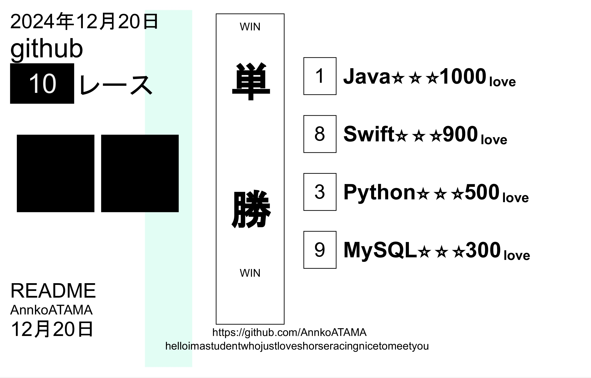

## GitHub Stats🐎

    
    

## Learning Journey🏇

    <table>
      <caption>Favorite Skill</caption>
      <thead>
        <tr>
          <th>No</th><th>skill</th> <th>favo</th>
        </tr>
      </thead>
      <tr>
        <td>1</td> <td align=center>  </td> <td>◎</td>
      </tr>
      <tr>
        <td>2</td> <td align=center>  </td> <td></td>
      </tr>
      <tr>
        <td>3</td> <td align=center>  </td> <td>▲</td>
      </tr>
      <tr>
        <td>4</td> <td align=center>  </td> <td></td>
      </tr>
      <tr>
        <td>5</td> <td align=center>  </td> <td></td>
      </tr>
      <tr>
        <td>6</td> <td align=center>  </td> <td>☆</td>
      </tr>
      <tr>
        <td>7</td> <td align=center>  </td> <td></td>
      </tr>
      <tr>
        <td>8</td> <td align=center>  </td> <td>○</td>
      </tr>
      <tr>
        <td>9</td> <td align=center>  </td> <td>△</td>
      </tr>
      <tr>
        <td>10</td> <td align=center>  </td> <td></td>
      </tr>
    </table>

